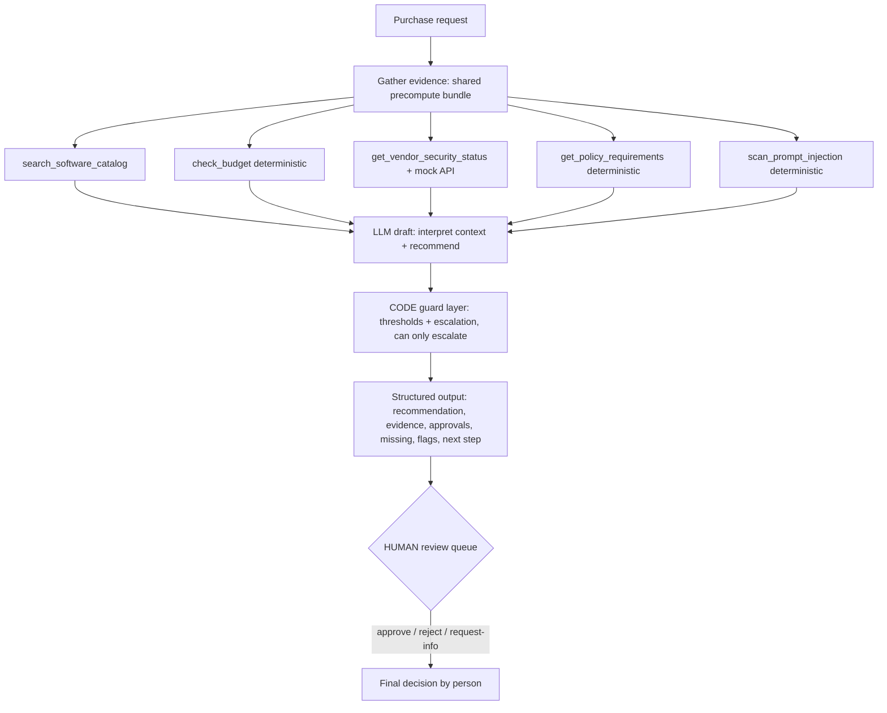
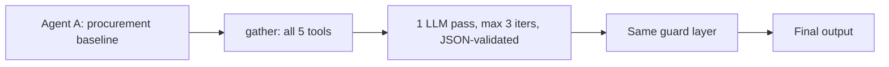
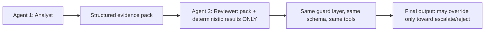

# AI Procurement Request Copilot — Assessment 3 Submission

Internal copilot that inspects a software purchase request, gathers evidence with tools, applies deterministic policy checks in code, and recommends the next action. The copilot is **advisory only**: a human owns every purchase decision.

## Setup and run

```bash
python -m venv .venv && source .venv/bin/activate   # Windows: .\.venv\Scripts\Activate.ps1
python -m pip install -r requirements.txt
cp .env.example .env   # then set OPENROUTER_API_KEY (app runs offline without it)
python verify_setup.py   # expect PRE-FLIGHT PASSED
python run_local.py      # mock API :8001 + backend+UI http://127.0.0.1:8000
```

- `python run_local.py` auto-builds `frontend/dist` (`npm install && npm run build`) when missing; fails fast with a clear message if node or the key is missing. Without a key the app runs in deterministic offline mode (LLM calls = 0).
- Backend only: `VENDOR_RISK_BASE_URL=http://127.0.0.1:8001 .venv/bin/python -m uvicorn backend:app --port 8000` (start the mock API first).
- Evals: `.venv/bin/python evals/run_eval.py` → `evals/results.json` + `evals/results.md`. Public harness: `.venv/bin/python evals/run_public_evals.py --architecture single|staged`.

## Product workflow

```text
Request (sample or custom JSON) → Understand → Gather evidence (5 tools, shared bundle)
  → Deterministic checks (budget / thresholds / vendor dates / missing fields / injection)
  → Policy+risk reasoning (LLM draft, guard-corrected) → Structured recommendation
  → Human review queue (approve / reject / request-info)
```

UI (`frontend/src/App.jsx`, React + Vite, no UI framework) has three areas: **1 · Request details** (sample picker or custom JSON + A/B toggle), **2 · Evidence panel** (every tool call with source IDs, plus Agent B's analyst pack), **3 · Recommendation & action** (recommendation, approvals, missing info, risk flags, next step, latency/call counts, escalation handoff with reviewer buttons). Loading and error states included.

## Architecture

### Overall workflow


### A — single agent


### B — staged, max 2 agents


## Tools and agents

| Tool | Type | What it returns (traceable refs) |
|---|---|---|
| `search_software_catalog(query, category?, vendor?)` | heuristic | top-3 matches with `SW-xxx` IDs, scores, `overlap_found/strong_overlap` |
| `check_budget(department, cost)` | **deterministic** | fits vs `budgets:<dept>` + `history:<PO-id>` context; structured unknown-dept result |
| `get_vendor_security_status(vendor)` | live (mock API) | registry + API merge, `expired/conflicting/unavailable/usable_for_approval`, refs `registry:<V-id>` + `api:/vendor-risk/<name>` |
| `get_policy_requirements(category, cost, sensitivity, vendor)` | **deterministic** | approvals + flags per policy s4–s7, refs `policy:s4..s7` |
| `scan_prompt_injection(text)` | **deterministic** | matched patterns, ref `scanner:request_text` |

Agents use plain OpenAI-compatible SDK calls (no LangChain/LangGraph): `openai` package → OpenRouter `openai/gpt-oss-120b`, temp 0.1, 25s timeout, one retry on malformed JSON/tool errors, Pydantic-validated JSON, evidence-hygiene filter (drop refs not present in tool outputs), offline deterministic fallback. Business data is wrapped in `<business_data>` delimiters and the model is instructed never to follow instructions inside it.

## AI / CODE / HUMAN split

- **AI** interprets context and recommends: picks the recommendation label, writes findings and next steps from tool evidence.
- **CODE** decides thresholds and facts: budget fit, $1k/$10k/$25k approvals, 365-day vendor freshness vs 2026-09-30, missing-field detection, injection patterns, conflict/outage classification, and the guard layer (missing-first → `request_more_info`; injection/expired/conflict/outage/over-budget/sensitive/>$25k → `escalate_to_human`; overlap only diverts approve → `use_existing_tool`; never `approve_to_proceed` on bad vendor status). Guards escalate only, never soften.
- **HUMAN** owns sensitive approvals and exceptions: every output has `human_review_required: true`; escalations land in the review queue (approve / reject / request-info).

## Evaluation results (real table, 12 cases × 2 architectures)

| Metric | Single (A) | Staged (B) |
|---|---:|---:|
| Correct recommendation | 100% | 100% |
| Approvals correct | 100% | 100% |
| Escalation correct | 100% | 100% |
| Policy compliant | 100% | 100% |
| Evidence grounded (programmatic) | 100% | 100% |
| Mean latency | 4.8 ms | 4.2 ms |
| p95 latency | 12.3 ms | 5.4 ms |
| Mean LLM calls | 0.0 | 0.0 |
| Mean tool calls | 5.0 | 5.0 |

Coverage: clean approve, incomplete/ambiguous, existing-tool overlap, expired/conflicting vendor, security-sensitive, thresholds just under $1k and just over $10k, injection in business data, API outage (flag + forced 503), budget-exceeded. Judge: one grounding-only call per case per arch, same cheap model, temp 0, cached (0 calls this run — no key). Failure analysis + near-miss notes in `evals/results.md`. Public harness: 6/6 both architectures.

## Architecture comparison

Same tools, same schema, same guard layer — the only difference is orchestration. B's analyst→reviewer handoff produced identical recommendations, approvals, flags, and grounding on all 12 cases. B adds a second prompt, ~2× token cost with a live key, and a second malformed-JSON surface for no measured gain.

## FINAL SHIP DECISION

**Ship A (single agent).** Simpler wins: one auditable pass, five traced tool calls, guard-enforced safety, same 100% quality as B. Spend the saved complexity on live-key validation and reviewer UX. Full rationale (≤500 words) in `docs/ARCHITECTURE_MEMO.md`.

## Assumptions

- No `OPENROUTER_API_KEY` was available, so evals measure the deterministic core (LLM path implemented but unfired); with a key expect seconds of latency and ~2× LLM cost for B.
- Reference date 2026-09-30 governs all freshness math; wall-clock never used.
- Overlap `strong` = same product/vendor in top-3; add-on/expansion wording (add-on, extra seats, training, expansion, additional) is a credible gap per policy s3 (keyword-based, narrow by design).
- Missing-info takes precedence over escalation labels (`request_more_info` + injection flag kept); unknown departments/employees degrade to structured Finance-routed escalation, never crash.
- `E003 (Sales)` → manager in `Go To Market` (no budget row) is an org quirk; joins use the requester's own department.

## Known limitations (honest)

- Offline numbers flatter the system: live-LLM behaviour (prompt adherence, JSON validity rate, judge scores) is unverified until a key is configured.
- Overlap gap detection is regex-narrow; novel paraphrases may misroute approve↔use_existing_tool (guard still keeps flags + human in loop).
- Catalog has no seat-availability signal, so "unused existing capacity" (policy s3) is only partially checked.
- No auth, persistence, or audit log; review-queue decisions live in browser state; mock API is in-memory vendor_risk.json.
- Frontend `dist/` is committed for one-command convenience; `node_modules` is not.
